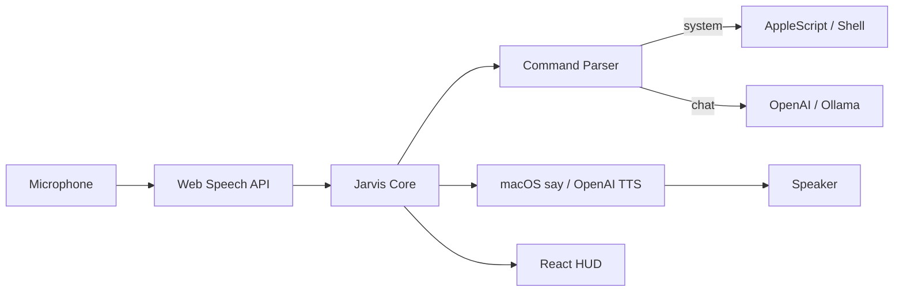

# JARVIS — macOS AI Desktop Assistant

A production-oriented macOS desktop assistant inspired by Iron Man's JARVIS. Built with **Electron**, **React**, **TypeScript**, **OpenAI**, and native **macOS automation** (AppleScript, shell, `osascript`).


## Features

- **Voice activation** — wake words: "Jarvis", "Hey Jarvis"
- **Speech-to-text** — Web Speech API (continuous) + optional OpenAI Whisper
- **Text-to-speech** — macOS `say` (Daniel voice) or OpenAI TTS
- **System control** — apps, volume, brightness, screenshots, files, clipboard, terminal, lock, shutdown/restart (with confirmation)
- **AI conversation** — OpenAI GPT with memory; optional **Ollama** offline mode
- **Browser automation** — Google search, open URLs, page summarization (Playwright)
- **Futuristic HUD UI** — glassmorphism, animated orb, waveform, command log
- **Menu bar** — background listening, hide to tray
- **Security** — destructive command blocking, confirmation dialogs

## Requirements

- macOS 12+ (Apple Silicon or Intel)
- Node.js 20+
- OpenAI API key (for AI chat; optional for basic system commands)
- Microphone access
- **System Settings → Privacy & Security** permissions (see [PERMISSIONS.md](./PERMISSIONS.md))

## Quick Start

```bash
# Clone / enter project
cd jarvisforyou

# Install dependencies
npm install

# Configure environment
cp .env.example .env
# Edit .env and set OPENAI_API_KEY=sk-...

# Run in development
npm run dev
```

**Keyboard shortcut:** `⌘⇧J` — show/hide window

## Environment Variables

Copy `.env.example` to `.env`:

| Variable | Description |
|----------|-------------|
| `OPENAI_API_KEY` | Required for AI chat and optional Whisper/TTS |
| `OPENAI_CHAT_MODEL` | Default: `gpt-4o-mini` |
| `JARVIS_TTS_ENGINE` | `macos` (default) or `openai` |
| `JARVIS_MACOS_VOICE` | Default: `Daniel` |
| `OLLAMA_ENABLED` | `true` for local LLM via Ollama |
| `JARVIS_CONFIRM_DESTRUCTIVE` | `true` (default) — confirm shutdown/restart |

## Voice Commands (Examples)

| Say | Action |
|-----|--------|
| "Hey Jarvis, open Safari" | Launch app |
| "Jarvis, close Spotify" | Quit app |
| "Search Google for best AI tools" | Opens Google search |
| "Increase volume" | Volume up |
| "Take a screenshot" | Saves to Desktop |
| "Create a folder called Projects" | Creates on Desktop |
| "Read clipboard" | Reads pasteboard |
| "Lock screen" | Locks Mac |
| "What's the weather?" | AI conversation (online) |

## Project Structure

```
src/
├── main/           # Electron main process, tray, IPC
├── preload/        # Secure bridge API
├── renderer/       # React UI (orb, visualizer, history)
├── voice/          # TTS engine
├── ai/             # OpenAI, Ollama, memory
├── system/         # macOS shell & AppleScript
├── automation/     # Playwright, Reminders
├── commands/       # Parser & executor
└── shared/         # Types, config, constants
```

## Build & Package (.dmg)

```bash
# Production build
npm run build

# Create macOS .dmg installer
npm run package:dmg
```

Output: `release/JARVIS-x.x.x.dmg`

For distribution, sign with your Apple Developer ID:

```bash
export CSC_LINK="path/to/certificate.p12"
export CSC_KEY_PASSWORD="your-password"
npm run package:dmg
```

## macOS Permissions

See **[PERMISSIONS.md](./PERMISSIONS.md)** for microphone, accessibility, automation, and screen recording setup.

## Architecture



## Custom Commands

Edit settings via `electron-store` or extend `customCommands` in settings:

```json
{
  "phrase": "start work mode",
  "action": "open_app",
  "payload": "Visual Studio Code"
}
```

## Troubleshooting

| Issue | Fix |
|-------|-----|
| No voice recognition | Grant Microphone + Speech Recognition in System Settings |
| Apps won't open/close | Grant Accessibility & Automation for JARVIS |
| TTS silent | Check `JARVIS_MACOS_VOICE` — run `say -v '?'` for voices |
| Playwright fails | Install Google Chrome: `npx playwright install chrome` |

## License

MIT
# jarvisforyou
